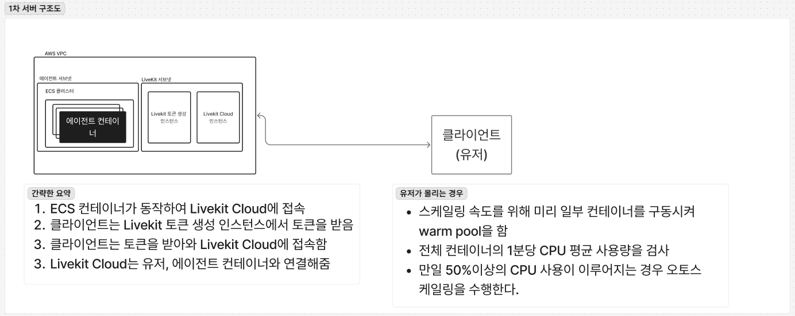
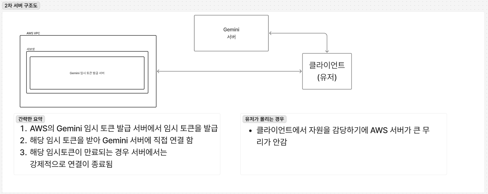

# 이 프로젝트에 대해서

이 프로젝트는 플레이모어의 과제의 결과,과정을 저장하기 위한 저장소입니다.

## 과제 내용

1. WebRTC 로 실시간 음성 통역을 하는 간단한 웹 앱을 만듭니다
2. 음성 대화 서버는 사용자가 연결되면 Agent 프로세스가 뜨는 방식입니다. LiveKit으로 테스트를 해 보셨으니 어떤 의미인지 알고계실 것 같습니다.
3. 음성 대화 서버의 사용자는 매우 유동적임을 가정합니다. 동시에 대화하는 사용자수가 0이었다가 바로 수천명이 될 수 있습니다.
4. 사용자가 연결 버튼을 눌렀을 때 첫 연결 속도가 1~2초 미만이어야합니다.
5. WebRTC나 서버 인프라는 PaaS/IaaS를 적극적으로 활용하셔도 됩니다.
6. 비용은 1인당/분당 2~3원 미만이어야합니다.

## 과제 내용 (추가)

1. 갑자기 사용자가 크게 증가해도, 사용자가 통화 버튼을 누르고 통화가 시작되기까지 수 초 이내로 달성하는 것이 목표입니다.

2. AI API 비용은 제외하고, 서버 인스턴스 비용만입니다.

## 사전 지식

Livekit 에이전트 서버와 Cloud는 각각 개별적인 언어, 사양을 가진 서버다.

Livekit 에이전트 시스템의 로드밸런스는 클라우드,오픈소스에 포함이 되어있다.

Livekit 에이전트 시스템에 Draining 신호를 받는 경우 종료를 준비하며 새로운 연결을 받지 않고 현재 연결만을 유지하며 연결이 모두 종료될 때 까지 기다리는 시스템이 있다.

Livekit 에이전트의 벤치마크의 경우 유저 10~25명을 수용하기 위해서는 4코어, 8GB의 사양이 필요한 것으로 확인됨. [출처](https://docs.livekit.io/agents/ops/deployment/custom/#memory-and-cpu)

Livekit Cloud의 벤치마크 c2-standard-16를 사용할때때 발행자 수 10명 구독자 수 3000명의 경우 최대 cpu를 80% 사용하는 것으로 확인됨

Livekit의 Agent의의 경우 voice pipeline(STT,LLM,TTS가 합쳐져 있는 형태),Realtime 모델(Gemini의 realtime,Openai의 realtime)의 형태가 존재한다.

Real-time 모델은 사용자의 오디오/비디오 입력을 LLM을 통해 텍스트로 변환하고, 이를 다시 TTS와 연동해 음성으로 출력할 수있다.

```python
from google.genai.types import Modality

session = AgentSession(
    llm=google.beta.realtime.RealtimeModel(modalities=[Modality.TEXT]),
    tts=cartesia.TTS(),
)
```

LiveKit에서는 RPC라는 방법을 통해 클라이언트,AI간의 서로간의 명령이 가능한데 이를 응용하여 여러 행동이 가능하다.

위 방법을 응용하여 유저가 버튼을 누르면 정해진 프롬프트를 삽입하여 각 언어마다 컨테이너를 띄우는 것이 아닌 유저의 요청에 따라 원하는 원어를 지원하게 할수있다.

### 이로 인해 알 수 있는 사실

LiveKit 에이전트의 경우 사양을 매우 많이 차지하는 것을 알 수 있음

Livekit 드라우닝 시스템을 통해 다운스케일을 할때 따로 구현해야하는 것이 적어진다.

## 과제에서 어려운 부분

- 동시에 대화하는 사용자수가 0이었다가 바로 수천명이 되어도 수초 이내로 달성하는 것이 목표
- 서버 인스턴스 비용은 1인당/분당 2~3원 미만이여야함

위 2가지에 문제가 있다.

### 스케일 아웃이 필요하다

서버 인스턴스 비용이 정해져 있는 상황에서 큰 서버를 준비할 수는 없다.

따라서 이런 경우 스케일 아웃을 통해 최대한 비용을 저렴하게 마련을 해야한다

이런 경우 또 다른 문제가 발생하게 된다.

#### 스케일아웃까지 걸리는 시간

서버를 스케일 아웃하는데 까지 걸리는 시간이 관건이다.

ECS의 Fargate를 사용하는 경우 최소 1~5분 정도가 소모된다.

## 해결법 1번

AWS의 warmpool을 사용하여 미리 여러 인스턴스를 대기 시킨다.

[](./1차.png)

### 해결법 1번의 장점

미리 정해진 수의 인스턴스를 제작을 한 다음 중지를 시켜 서버 스케일 아웃까지 걸리는 시간을 절반 가까이 줄일수가 있었다.

서버 인스턴스 비용이 1인당/분당 2~3원 미만이여야한다는 조건을 지킬 수 있다.

### 해결법 1번의 단점

만약 스케일 아웃이 매우 빨라 정해진 수의 인스턴스를 넘어가게 되면 warmpool을 했음에도 콜드스타트 시간이 필요하다

## 해결법 2번

OpenAI,Gemini에서 공식문서로 제공하는 임시토큰 시스템을 사용한다.

이때 임시토큰은 LiveAPI,Realtime에서만 지원하는 것으로 보이며 현재 openai,gemini에서만 가능하다

OpenAI는 WebRTC,WebSocket를 지원한다. [출처](https://platform.openai.com/docs/guides/realtime)

Gemini는 WebSocket만을 지원한다. [출처](https://ai.google.dev/gemini-api/docs/live#implementation-approach)

[Openai 임시토큰 관련 페이지](https://platform.openai.com/docs/guides/realtime#creating-an-ephemeral-token)

[Gemini 임시토큰 관련 페이지](https://ai.google.dev/gemini-api/docs/ephemeral-tokens?hl=ko)

[](./2차.png)

### 해결법 2번의 장점

클라이언트가 대부분의 사양을 감당하며 서버는 단지 임시토큰을 발급만 해주면된다.

100명,1000명이 한번에 접속을 시도해도 서버는 단지 임시토큰을 발급만 해주면면 되며 이는 1번 방법과 달리 서버가 중계를 하지 않아도 되기에 비해 비교적 적은 부하로도 많은 유저를 감당할 수 있다.

### 해결법 2번의 단점

OpenAI,Gemini의 플랫폼에 종속이 되며 만일 TTS를 따로 써야하는 경우 따로 유저가 TTS서버에 요청을 해야하는 불편함이 있다.

프롬프트가 유출되기 쉬워진다.

## 해결법 3번

Eleven Labs의 conversational agent platform을 사용한다.

### 해결법 3번의 장점

해결법 1번에 비해 비교적 개발,세팅해야할 것이 적어진다.
원하는 LLM을 정할 수 있다.
여러 편의 기능을 제공한다.

### 해결법 3번의 단점

Eleven Labs에 종속되며 만일 TTS를 외부 업체에서 사용하는 경우 어려움이 따른다.

분당 100원~170원까지 비용이 청구된다.

## 해결법 4번

Livekit의 Agent hosting 기능을 사용한다.

## 장점

Livekit의 커스텀 마이징의 장점을 그대로 가져가며 호스팅을 맡길수있다.

## 단점

분당 14원 정도의 서버 이용 비용이 청구된다.

현재 2025-08-24 기준으로 us-east(N. Virginia)지역에만 배포된다는 문제가 있다.
